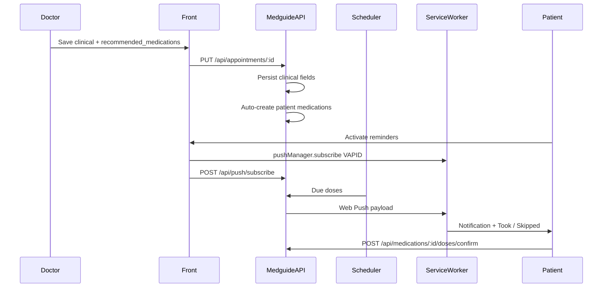

# Doctor Prescriptions + Web Push Adherence Implementation Plan

> **For agentic workers:** REQUIRED SUB-SKILL: Use superpowers:subagent-driven-development (recommended) or superpowers:executing-plans to implement this plan task-by-task. Steps use checkbox (`- [ ]`) syntax for tracking.

**Goal:** After a consultation, the doctor saves structured medication recommendations (name, dosage, times, duration); the backend auto-creates patient medications; the patient receives Web Push reminders and can confirm took / did not take each dose.

**Architecture:** Extend the existing clinical-record + patient-medications stack already merged upstream. Doctor UI sends structured `recommended_medications[]` on the appointment clinical PUT. Backend persists clinical text fields, creates/updates patient `Medication` rows (source = doctor, with `durationDays` and `appointmentId`), and owns the push scheduler. Front restores VAPID subscribe flow and adds dose-adherence actions.

**Tech Stack:** Next.js App Router, next-auth / localStorage token, Serwist SW, Web Push (VAPID), Medguide REST API.

**Spec decisions (locked):**
1. Web Push + VAPID (not in-app-only).
2. Auto-create patient medications when the doctor saves the clinical record (no patient “accept” step).

**Base:** Sync local `main` from upstream `PedroHSFreire/medguide_front` (PRs #2 and #3 already merged). Work on branch `feat/doctor-prescriptions-push`.

## Global Constraints

- Auth: `Authorization: Bearer <token>` (existing patient/doctor pattern).
- Do not commit secrets; VAPID private key stays on Medguide only.
- `NEXT_PUBLIC_VAPID_PUBLIC_KEY` required for subscribe UI.
- Serwist remains disabled in `next dev`; validate push with production build.
- Keep free-text `prescription` / `doctor_notes` / `diagnosis` for backward compatibility; structured meds are additive.
- Patient can still CRUD self-entered meds; doctor-sourced meds are editable only for `active` pause (no overwrite of doctor fields from patient form in v1 — patient may pause/delete with confirm).

## Review Focus

- Structured med payload shape matches backend contract.
- Auto-create is server-side (front does not POST `/api/medications` on clinical save).
- Push subscribe + SW handlers restored; adherence endpoints wired.
- No VAPID private key in the front repo.

## File map

| Path | Role |
| --- | --- |
| `src/app/lib/types/medications.ts` | Extend `Medication` with `durationDays`, `source`, `appointmentId`; add adherence types |
| `src/app/lib/types/prescriptions.ts` (new) | `RecommendedMedication` for clinical payload |
| `src/components/ClinicalRecordModal.tsx` | Structured meds editor (name, dosage, times[], durationDays) |
| `src/app/lib/hooks/useDoctorAppointments.ts` | Include `recommended_medications` in clinical PUT |
| `src/app/doctor/dashboard/page.tsx` | Pass structured initial values / show recommended meds summary |
| `src/app/pacient/medicamentos/page.tsx` | Show source/duration; due-dose confirm UI |
| `src/app/lib/service/medicationService.ts` | Adherence + due-doses API calls |
| `src/app/lib/hooks/useMedications.ts` | Expose adherence helpers |
| `src/app/lib/service/pushService.ts` (restore) | subscribe / unsubscribe / test |
| `src/app/lib/hooks/usePushNotifications.ts` (restore) | Permission + subscribe lifecycle |
| `src/app/lib/utils/vapid.ts` (restore) | base64url → Uint8Array |
| `src/app/sw.ts` | Restore `push` + `notificationclick` (+ optional action buttons) |
| `.env.example` | Re-document `NEXT_PUBLIC_VAPID_PUBLIC_KEY` |
| `src/app/pacient/dashboard/page.tsx` | Copy for notifications if needed |



---

## Task 1: Sync base and branch

- [ ] Fetch upstream and fast-forward local `main` to include merged appointments + medications.
- [ ] Create `feat/doctor-prescriptions-push` from updated `main`.
- [ ] Confirm `ClinicalRecordModal`, `/pacient/medicamentos`, and Serwist PWA files are present.
- [ ] Commit: none (branch only) or chore sync if needed.

## Task 2: Types for structured prescriptions and extended medications

- [ ] Add `src/app/lib/types/prescriptions.ts`:

```ts
export type RecommendedMedication = {
  name: string;
  dosage?: string;
  times: string[];       // ["08:00","20:00"]
  durationDays: number;  // >= 1
};
```

- [ ] Extend `Medication` in `src/app/lib/types/medications.ts`:

```ts
export type MedicationSource = "patient" | "doctor";

export type Medication = {
  id: string;
  name: string;
  dosage?: string;
  times: string[];
  active: boolean;
  timezone: string;
  durationDays?: number | null;
  source?: MedicationSource;
  appointmentId?: string | null;
  endsAt?: string | null; // ISO, computed by backend from start + durationDays
  createdAt: string;
  updatedAt: string;
};

export type DoseConfirmationBody = {
  scheduledFor: string; // ISO datetime of the dose slot
  status: "taken" | "skipped";
};

export type DueDose = {
  medicationId: string;
  medicationName: string;
  dosage?: string;
  scheduledFor: string;
  status?: "pending" | "taken" | "skipped";
};
```

- [ ] Commit: `feat: add prescription and adherence types`

## Task 3: ClinicalRecordModal — structured medication recommendations

- [ ] Keep existing `diagnosis`, `prescription` (free text), `doctor_notes`.
- [ ] Extend `ClinicalRecordFields` with `recommended_medications?: RecommendedMedication[]`.
- [ ] UI: list editor — add/remove rows; fields name, dosage, time inputs, durationDays (number).
- [ ] Validate: each row needs name, ≥1 `HH:mm` time, `durationDays >= 1`.
- [ ] Empty list is allowed (clinical notes only).
- [ ] Commit: `feat: add structured med recommendations to clinical modal`

## Task 4: Wire clinical PUT from doctor dashboard

- [ ] Update `ClinicalRecordData` / `updateAppointmentClinical` in `useDoctorAppointments.ts` to send:

```ts
{
  diagnosis,
  prescription,
  doctor_notes,
  recommended_medications: RecommendedMedication[]
}
```

- [ ] On success, refetch appointments; if API returns created meds count in response, show toast/message (optional `createdMedications?: number`).
- [ ] Display on appointment card: count of recommended meds or names when present on appointment payload (`recommended_medications` or nested).
- [ ] Commit: `feat: send recommended_medications on clinical save`

## Task 5: Restore Web Push / VAPID client

- [ ] Restore `vapid.ts`, `pushService.ts`, `usePushNotifications.ts` (from pre-`de253a8` history on medication-reminders).
- [ ] Restore push UI section on `/pacient/medicamentos` (Ativar / Desativar / Enviar teste).
- [ ] Re-add `NEXT_PUBLIC_VAPID_PUBLIC_KEY` to `.env.example`.
- [ ] Restore `push` + `notificationclick` in `src/app/sw.ts`.
- [ ] Extend notification to support action buttons when present in payload:

```ts
actions: [
  { action: "taken", title: "Tomei" },
  { action: "skipped", title: "Não tomei" },
]
```

- [ ] On `notificationclick`, if action is `taken`/`skipped`, `fetch` adherence endpoint with Bearer token from… **constraint:** SW cannot read `localStorage`. Use:
  - Prefer: open app URL `/pacient/medicamentos?confirm=taken&medicationId=…&scheduledFor=…` and let the page complete the POST; **or**
  - Store a short-lived token in Cache/IndexedDB at subscribe time (more complex).
- [ ] **Chosen approach:** notification click / action navigates to `/pacient/medicamentos` with query params; page reads params once, calls API, clears query. Keeps auth in the page context.
- [ ] Commit: `feat: restore Web Push subscribe and SW handlers`

## Task 6: Patient medications UI — doctor source + adherence

- [ ] List badges: `Prescrito pelo médico` when `source === "doctor"`; show `durationDays` / `endsAt`.
- [ ] Section “Doses de hoje” (or pending due doses): load `GET /api/medications/due` (or `/api/doses/due`).
- [ ] Buttons **Tomei** / **Não tomei** per due dose → `POST /api/medications/:id/doses/confirm`.
- [ ] Handle deep-link query from SW actions (Task 5).
- [ ] Self-serve create form unchanged for patient-sourced meds; optional `durationDays` on patient create (can omit in v1).
- [ ] Commit: `feat: show doctor meds and dose confirmation UI`

## Task 7: Push payload contract alignment

- [ ] Document expected push JSON (SW + backend):

```json
{
  "title": "Hora do medicamento",
  "body": "Losartana 50mg — 08:00",
  "url": "/pacient/medicamentos?medicationId=...&scheduledFor=...",
  "medicationId": "...",
  "scheduledFor": "2026-10-09T08:00:00-03:00",
  "actions": true
}
```

- [ ] Commit: `docs: note push payload for adherence deep links` (update existing medication-reminders design or short note in plan only — prefer updating `docs/superpowers/specs/2026-10-04-medication-reminders-design.md` with an “Amendment” section).

## Task 8: Manual verification

- [ ] Doctor completes appointment → clinical modal → add 1–2 structured meds → save.
- [ ] As patient, open `/pacient/medicamentos` → see auto-created meds with doctor source.
- [ ] Activate push (prod build + VAPID) → test notification → click Tomei → dose confirmed.
- [ ] Patient pause/delete still works.
- [ ] Regression: free-text diagnosis/prescription/notes still save.

---

## Backend requirements (deliver to Medguide)

Auth on all routes: patient or doctor JWT as appropriate. Prefer JSON `{ message }` on errors.

### A. Extend clinical update (doctor)

`PUT /api/appointments/:id`

Body (additive):

```ts
{
  diagnosis?: string | null;
  prescription?: string | null;      // free text, keep
  doctor_notes?: string | null;
  recommended_medications?: Array<{
    name: string;
    dosage?: string;
    times: string[];      // ["08:00","20:00"]
    durationDays: number; // integer >= 1
  }>;
}
```

**Server behavior when `recommended_medications` is present (non-empty):**

1. Persist clinical text fields as today.
2. For each item, **create** a patient medication owned by the appointment’s `pacient_id`:
   - `name`, `dosage`, `times`, `active: true`
   - `timezone`: patient profile timezone or `America/Sao_Paulo`
   - `durationDays`, `source: "doctor"`, `appointmentId`
   - `endsAt` = start-of-treatment + `durationDays` (define start as appointment date or “now”)
3. Idempotency recommendation: replacing recommendations on re-save either (a) soft-deactivate previous doctor meds for that `appointmentId` then recreate, or (b) reject second structured save — **prefer (a)**.
4. Response may include `createdMedications: number`.

### B. Extend medication model (patient list)

`GET /api/medications` returns items including:

| Field | Notes |
| --- | --- |
| existing CRUD fields | `id`, `name`, `dosage`, `times`, `active`, `timezone`, timestamps |
| `durationDays` | optional |
| `source` | `"patient"` \| `"doctor"` |
| `appointmentId` | optional |
| `endsAt` | optional ISO; scheduler must stop after this |

Patient `POST/PUT` self-meds remain; doctor-sourced rows should not be freely renamed via patient PUT in v1 (or allow only `active`).

### C. Web Push (restore)

| Method | Path | Role |
| --- | --- | --- |
| `POST` | `/api/push/subscribe` | Store PushSubscription JSON |
| `DELETE` | `/api/push/subscribe` | Remove by `endpoint` |
| `POST` | `/api/push/test` | One test push to current user |
| `GET` | `/api/push/vapid-public-key` | Optional if front env has public key |

Env on Medguide: VAPID **private** key + subject. Front gets public key only.

### D. Scheduler

Every 1–5 minutes: active meds whose local `times` match current window in `timezone`, and `now < endsAt` (if set), send Web Push with payload above. Deduplicate per `(medicationId, scheduledFor)`.

### E. Adherence / dose confirmation

| Method | Path | Role |
| --- | --- | --- |
| `GET` | `/api/medications/due` | Pending (and today’s) doses for authenticated patient |
| `POST` | `/api/medications/:id/doses/confirm` | Body: `{ scheduledFor: string, status: "taken" \| "skipped" }` |

`GET /api/medications/due` example item:

```ts
{
  medicationId: string;
  medicationName: string;
  dosage?: string;
  scheduledFor: string; // ISO
  status: "pending" | "taken" | "skipped";
}
```

### F. Priority for E2E

1. Clinical PUT + auto-create meds  
2. Medication list with new fields  
3. Push subscribe + test  
4. Scheduler  
5. Due doses + confirm  

Without (1)+(2) the doctor→patient pipeline fails. Without (3)–(5) notifications/adherence fail.

### G. Out of scope (this plan)

- SMS/email fallback  
- Doctor viewing adherence history dashboard (can be follow-up)  
- Editing structured meds after save from doctor UI beyond re-save replace policy  
- Offline dose confirmation
