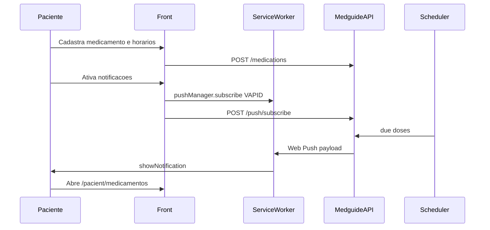

# Medication Reminders (Web Push) — Design Spec

Date: 2026-10-04  
Repo: `medguide_front`  
Base branch: `feat/pwa-installable` (Serwist PWA installable; no push yet)  
Companion API: [Medguide](https://github.com/PedroHSFreire/Medguide)

## Intent

Give patients reliable medication dose reminders via **Web Push** (works with the PWA closed), based on schedules the **patient registers themselves**. Doctor-authored prescriptions are out of scope for this iteration.

Success criteria:

- Patient can CRUD medications with daily times.
- Patient can opt in to notifications; subscription is stored on the Medguide API.
- Backend can send a push that the Serwist service worker displays.
- Tapping the notification opens the patient medications screen.
- Works on a production build (`next build` + `next start`) over HTTPS or localhost.

## Approach

**Front + Medguide contract (Approach A).**

- Frontend owns UI, permission/subscribe flow, and SW `push` / `notificationclick` handlers.
- Medguide owns medication persistence, push subscription storage, VAPID private key, and the scheduler that sends due-dose pushes.
- A `POST /api/push/test` endpoint exists so the frontend can validate end-to-end before the cron is fully tuned.

Rejected alternatives:

- Next.js BFF + Vercel cron for meds/push (wrong persistence layer; couples secrets to the front deploy).
- Client-only IndexedDB schedules (not reliable with app closed; fails the Web Push requirement).

## Architecture



## API contract (Medguide)

Auth: `Authorization: Bearer <token>` for the authenticated patient (same pattern as existing services).

### Medications — `/api/medications`

| Method | Path | Notes |
| --- | --- | --- |
| `GET` | `/api/medications` | List for authenticated patient |
| `POST` | `/api/medications` | Create |
| `PUT` | `/api/medications/:id` | Partial update |
| `DELETE` | `/api/medications/:id` | Delete |

Request/response shape:

```ts
type Medication = {
  id: string;
  name: string;
  dosage?: string; // e.g. "1 comprimido"
  times: string[]; // ["08:00", "20:00"] local wall-clock
  active: boolean;
  timezone: string; // e.g. "America/Sao_Paulo"
  createdAt: string;
  updatedAt: string;
};

type CreateMedicationBody = {
  name: string;
  dosage?: string;
  times: string[];
  active?: boolean;
  timezone?: string;
};
```

Default `timezone` on create: `Intl.DateTimeFormat().resolvedOptions().timeZone`.

### Push — `/api/push`

| Method | Path | Notes |
| --- | --- | --- |
| `GET` | `/api/push/vapid-public-key` | Optional if front uses `NEXT_PUBLIC_VAPID_PUBLIC_KEY` |
| `POST` | `/api/push/subscribe` | Body: PushSubscription JSON (`endpoint`, `keys.p256dh`, `keys.auth`); optional `userAgent` |
| `DELETE` | `/api/push/subscribe` | Body with `endpoint`, or deactivate all for user |
| `POST` | `/api/push/test` | Sends one test notification to the current user |

Push payload (JSON):

```json
{
  "title": "Hora do medicamento",
  "body": "Losartana 50mg — 08:00",
  "url": "/pacient/medicamentos",
  "medicationId": "..."
}
```

### Scheduler (backend only)

Periodic job (every 1–5 minutes) finds active medications whose local `times` match the current window in `timezone`, then sends Web Push with the payload above. Deduplication per dose slot is a backend concern.

## Frontend changes

Branch from `feat/pwa-installable`.

| Path | Role |
| --- | --- |
| `src/app/sw.ts` | Add `push` + `notificationclick` handlers (keep Serwist precache) |
| `src/app/lib/types/medications.ts` | Types |
| `src/app/lib/service/medicationService.ts` | CRUD HTTP against `${NEXT_PUBLIC_API_URL}/api` |
| `src/app/lib/service/pushService.ts` | subscribe / unsubscribe / test |
| `src/app/lib/hooks/useMedications.ts` | List/CRUD state |
| `src/app/lib/hooks/usePushNotifications.ts` | Permission + subscribe lifecycle |
| `src/app/pacient/medicamentos/page.tsx` | Patient CRUD UI + reminder CTA |
| `src/app/pacient/dashboard/page.tsx` | Entry point to Medicamentos |
| `.env.example` | Document `NEXT_PUBLIC_VAPID_PUBLIC_KEY` |

Follow existing service patterns: read `token` from `localStorage`, send `Authorization: Bearer <token>`.

### UI (v1)

- List medications with name, dosage, times, active toggle.
- Form to create/edit: name, dosage (optional text), one or more `HH:mm` times.
- Actions: pause/resume (`active`), delete.
- CTA “Ativar lembretes” + “Enviar teste”.
- States: unsupported, denied, granted+subscribed, iOS not installed (short copy when not `display-mode: standalone` on iPhone).

### Service worker behavior

- On `push`: parse JSON payload; `showNotification(title, { body, data: { url } })`; if payload invalid, show generic “Hora do medicamento” and default URL `/pacient/medicamentos`.
- On `notificationclick`: focus existing client or `openWindow` to `data.url`.
- On `pushsubscriptionchange` (if available): re-subscribe and `POST /push/subscribe` when the client can assist; document backend tolerance for stale endpoints.

## Error handling and edge cases

- Permission denied: explain how to re-enable in browser settings; do not loop prompts.
- Serwist disabled in development: validate push with production build.
- iOS: Web Push only after Add to Home Screen; surface that constraint in UI.
- Subscribe requires authenticated patient.
- Missing `NEXT_PUBLIC_VAPID_PUBLIC_KEY`: disable activate button with config message.
- API failures: surface error on list/opt-in; do not corrupt local UI state.
- Notification body limited to patient-entered name/dosage/time (no extra clinical data).

## Out of scope (v1)

- Doctor prescription → patient reminder pipeline.
- “Took dose” / snooze / adherence history.
- Email SMS fallback.
- Deep iOS install coaching beyond a short note.
- Offline medication CRUD.

## Test plan

1. Base branch includes PWA (Serwist + manifest); production build locally.
2. Patient login → create / edit times / pause / delete medication via API.
3. Activate reminders → permission granted → subscription stored on Medguide.
4. `POST /api/push/test` → notification with app backgrounded or closed.
5. Notification click → `/pacient/medicamentos`.
6. Deny permission → correct UI state.
7. Optional: backend cron with a due slot → automatic push.

## Dependencies

This frontend PR **requires** Medguide endpoints above. Minimum for E2E validation: medication CRUD + push subscribe + push test. Cron can land immediately after if not ready on day one.

## Env

| Variable | Where | Purpose |
| --- | --- | --- |
| `NEXT_PUBLIC_API_URL` | Front (existing) | Medguide base URL without `/api` |
| `NEXT_PUBLIC_VAPID_PUBLIC_KEY` | Front | `pushManager.subscribe` applicationServerKey |
| VAPID private key + subject | Medguide only | Sign outgoing Web Push |

## Amendment (2026-10-09) — Doctor prescriptions + adherence

- Clinical `PUT /api/appointments/:id` accepts `recommended_medications[]` (`name`, `dosage?`, `times`, `durationDays`). Backend auto-creates patient medications (`source: "doctor"`).
- Medication model adds `durationDays`, `source`, `appointmentId`, `endsAt`.
- Adherence: `GET /api/medications/due`, `POST /api/medications/:id/doses/confirm` with `{ scheduledFor, status: "taken"|"skipped" }`.
- Push payload should include `medicationId`, `scheduledFor`, and deep-link `url` so notification actions open `/pacient/medicamentos?confirm=…` (auth happens in the page, not the SW).
